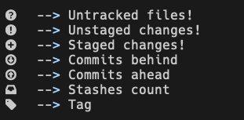

# vifm-powerline! :sweat_drops:

Powerline statusbar implementation for [Vifm](http://vifm.info) 

### Pre-requisites

- [Vifm](http://vifm.info) (obviously :neckbeard:)
- A powerline font set up in your terminal emulator!

### Install

Simply run:
```
git clone --depth=1 https://github.com/rusito-23/vifm-powerline.git ~/.vifm
```
and that's it!

### Features

- A powerline statusbar with the following segments:


The **git segment** may contain the following information:



- a vifmrc for you to configurate

- All [Vifm colorschemes!](https://vifm.info/colorschemes.shtml)
